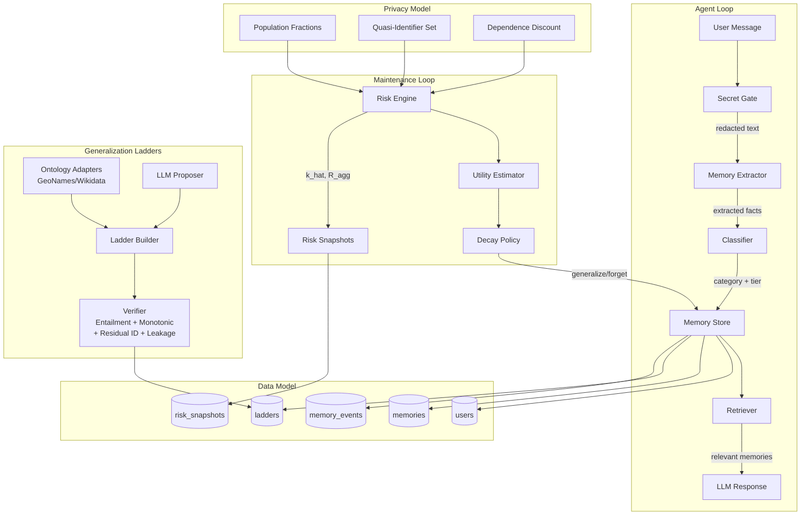

# PGM — Progressive Generalization Memory

> A privacy-preserving long-term memory layer for LLM agents.

**Core principle**: Retain the least precise representation of each memory that
still provides sufficient expected utility, while keeping the aggregate
re-identification risk of the whole memory store under a budget.

## Architecture



## Quickstart

### Prerequisites
- Python ≥ 3.11
- PostgreSQL ≥ 16
- Node.js ≥ 18 (for dashboard, M7)

### Setup

```bash
# 1. Clone and enter
git clone <repo-url> && cd pgm

# 2. Create virtual environment and install
python -m venv .venv
.venv/Scripts/pip install -e ".[dev]"    # Windows
# or: .venv/bin/pip install -e ".[dev]"  # Unix

# 3. Configure
cp .env.example .env
# Edit .env with your database URL and API keys

# 4. Create database and run migrations
createdb pgm
.venv/Scripts/python -m alembic upgrade head

# 5. Run tests
.venv/Scripts/python -m pytest tests/ -v
```

### Run the main experiment (M6+)

```bash
make eval
```

## Project Structure

```
src/pgm/
├── config.py              # Central configuration (Pydantic Settings)
├── models.py              # Shared Pydantic v2 models
├── db/                    # Database engine + ORM tables
├── llm/                   # LLMClient interface + Embedder
├── classification/        # Secret gate + category/tier assignment
├── extraction/            # LLM-based memory extraction
├── storage/               # Memory CRUD, contradictions, events
├── retrieval/             # Hybrid vector + keyword search
├── ladders/               # Generalization ladders (M2)
├── risk/                  # Aggregate risk computation (M3)
├── utility/               # Utility estimators (M4)
├── decay/                 # Decay policies (M4)
├── agent/                 # LangGraph agent loop (M5)
└── api/                   # FastAPI routes (M5)

tests/                     # pytest test suite
eval/                      # Evaluation harness (M6)
dashboard/                 # React + TypeScript frontend (M7)
docs/                      # Documentation
alembic/                   # Database migrations
```

## Milestones

| # | Scope | Status |
|---|-------|--------|
| M1 | Schema, config, secret gate, extraction, storage, basic retrieval | 🟢 Done |
| M2 | Ladders: ontology adapters + LLM proposer + verifier + leakage probe | 🟢 Done |
| M3 | Risk engine: population fractions, k-hat, aggregate bits | 🟢 Done |
| M4 | Utility estimators + decay policies + solver + greedy | 🟢 Done |
| M5 | LangGraph agent + FastAPI + maintenance scheduler | 🟢 Done |
| M6 | Synthetic benchmark + attacks + metrics + experiments | 🟢 Done |
| M7 | Dashboard (React + TypeScript) | 🟢 Done |
| M8 | Docs, reproducibility, limitations | ⬜ |

## Key Design Decisions

See [docs/ASSUMPTIONS.md](docs/ASSUMPTIONS.md) for implementation assumptions.
See [docs/TAXONOMY.md](docs/TAXONOMY.md) for sensitivity category sources.
See [docs/PRIVACY_CONCEPTS.md](docs/PRIVACY_CONCEPTS.md) for privacy model analysis.
See [docs/RELATED_WORK_TODO.md](docs/RELATED_WORK_TODO.md) for papers to verify.

## License

MIT
